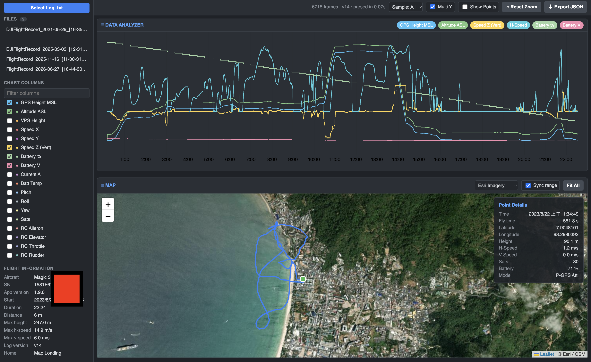
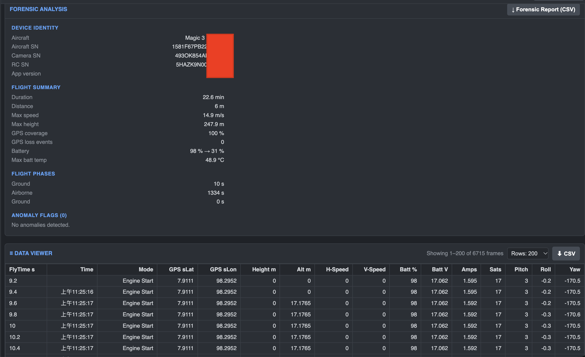
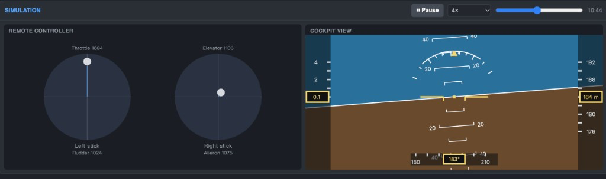

# DJI Flight Log Viewer

A local web application that decrypts and visualizes **DJI v14 encrypted flight logs** (`.txt` flight records from DJI Fly), with a datfile.in-style dark UI.

 

Chart, map, and flight details:



Forensic analysis and data table:



Stick movement and cockpit view:



## Features

- **Encrypted log parsing** — DJI Fly v14 logs are encrypted per-record. This parser implements the full pipeline: CRC-64 framing, XOR seed derivation, AES-128-CBC decryption with per-feature-point IV chains, and keychain retrieval via the DJI Developer API (`https://developer.dji.com/api/openapi/v1/appapi/component/info/keychain`).
- **DATA ANALYZER** — multi-series uPlot chart (height, altitude, speeds, battery, attitude, RC sticks) with multi-Y axes, brush zoom, and hover crosshair.
- **MAP** — Leaflet map with Esri satellite imagery / OpenStreetMap / OpenTopoMap, flight track polyline, clickable points, and a Point Details panel synced with the chart.
- **DATA VIEWER** — sortable data table with row count selector and CSV export.
- **Flight info & timeline** — aircraft model, SN, app version, duration, distance, max height/speed, battery consumption, and flight event timeline.
- **Upload & cache** — upload new logs in the UI; parsed results and DJI keychains are cached on disk so repeat loads are instant.

## Supported data

| Data | Source |
|---|---|
| GPS position, height, velocity, sats | OSD records (feature point 0) |
| Battery %, voltage, current, temperature, cells | SmartBattery records (type 22) |
| Pitch / roll / yaw | Gimbal/attitude records |
| RC sticks, switches | RC records |
| Flight events (power on, motors, take-off, landing) | Details/Aux records |

## Windows — one click

1. Download this repository (Code → Download ZIP) and unzip it.
2. Double-click **`Install and Open.bat`**.

The first run installs Python 3.12 if it is missing, creates a local environment, installs Flask and cryptography, and opens <http://127.0.0.1:8080>. Leave the command window open while you use the viewer. Close that window to stop it. Later double-clicks check that Python, Flask, and cryptography are already installed, then open the app without installing again.

Paste your own DJI Developer API key into the sidebar before opening an encrypted log.

## macOS and Linux — step by step

These steps use the Terminal. On macOS open **Terminal** from Applications → Utilities, or press Command–Space and type `Terminal`. On Linux open the program named **Terminal**.

You need **Python 3.10 or newer**. The viewer’s packages (Flask and cryptography) are installed inside a **virtual environment**: a private folder named `.venv` in this project, so they do not change the rest of the computer.

### 1. Get the project

Download the ZIP from this repository (Code → Download ZIP), unzip it, and move into that folder. The folder name below is an example; use the name you actually unzipped.

```bash
cd ~/Downloads/dji-flight-log-viewer-main
```

`cd` means “change directory”. `ls` lists the files. You should see `app.py` and `requirements.txt`.

```bash
ls
```

### 2. Check whether Python is already installed

```bash
python3 --version
```

If this prints `Python 3.10` or a higher number, such as `Python 3.12.6`, skip to step 3.

If the command is not found, or the version is older than 3.10, install Python:

**macOS** (uses [Homebrew](https://brew.sh)). If `brew` is not found, install Homebrew from that page first, then:

```bash
brew install python@3.12
python3 --version
```

**Debian, Ubuntu, or Kali:**

```bash
sudo apt update
sudo apt install -y python3 python3-venv python3-pip
python3 --version
```

`sudo` asks for your login password. The password does not appear as you type. `python3-venv` is required; without it, the next step fails with `No module named venv`.

**Fedora:**

```bash
sudo dnf install -y python3
python3 --version
```

### 3. Create the virtual environment

Run this once, from the project folder:

```bash
python3 -m venv .venv
```

That creates a `.venv` folder. Nothing is installed for the viewer yet.

Turn the environment on for this Terminal window:

```bash
source .venv/bin/activate
```

The start of the line changes to `(.venv)`. Commands typed after this use the environment’s Python. Opening a new Terminal window turns it off again; run `source .venv/bin/activate` in the project folder to turn it back on.

### 4. Install Flask and cryptography

Still inside `(.venv)`:

```bash
python -m pip install --upgrade pip
python -m pip install -r requirements.txt
```

The first run downloads the packages and needs an internet connection. When it finishes, check them:

```bash
python -c "import flask, cryptography; print('ready', flask.__version__)"
```

`ready` plus a version number means the install worked.

### 5. Start the viewer

```bash
python app.py
```

Leave this Terminal window open. Open a browser at <http://127.0.0.1:8080>. Paste your own DJI Developer API key into the sidebar before opening an encrypted log. Press **Control–C** in the Terminal to stop the viewer.

### Later visits

If Python, Flask, and cryptography are already installed, do not repeat steps 2–4. From the project folder:

```bash
source .venv/bin/activate
python app.py
```

Then open <http://127.0.0.1:8080> again.

On Debian, Ubuntu, or Kali, `sudo ./install.sh` does steps 2–5 in one command and listens on every network interface at port 8080.

## DJI API key

v14 logs are encrypted; decryption requires a **personal DJI Developer API key** (free at the [DJI Developer portal](https://developer.dji.com/doc/open-api-tutorial/en/)).

- **In the app**: paste your key into the **DJI API KEY** field in the sidebar and click *Save Key* — it is stored in your browser (`localStorage`) and sent only with parse requests.
- **On the server** (optional): `DJI_API_KEY=your_key .venv/bin/python app.py`

The key is never embedded in the code. Log files are decrypted locally and are **not uploaded** anywhere; only the key request goes to DJI.

## Files

```
Install and Open.bat Windows one-click setup and launcher
install.sh           Linux installer
app.py               Flask server + on-disk cache
dji_log_parser.py    Core parser (CRC-64, XOR/AES, keychain API, record decoding)
requirements.txt     Python packages
static/              UI (index.html, style.css, app.js)
```

## Log compatibility

Tested with v14 logs from **DJI Mini 3 Pro**, **DJI Neo**, and **Mavic 3 Classic** (`DJIFlightRecord_2023-08-22_[11-25-16].txt` on the viewer machine). The log stores the aircraft as “Magic 3 Classic”; the parser shows it as Mavic 3 Classic. The Neo has no GPS, so map view is gracefully skipped for such logs.